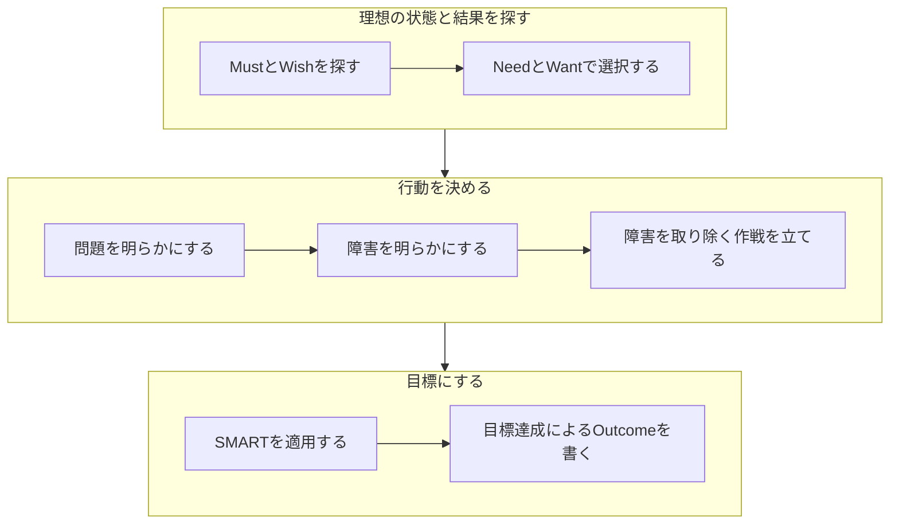

> **Note** 内容の信憑性についての「[おことわり](https://github.com/YukiMatsumura/knowledge/blob/main/NOTICE.md)」

# 目標設定のやり方 - 解決志向アプローチ

目標設定をすることで、達成率に良い影響があります。[^research1] [^research2] [^research3]
また、目標設定で重要なのは目標に対するモチベーションと言われています。[^theory1] [^theory2]

本稿では、モチベーションを軸に、障害にフォーカスした目標設定のやり方を紹介します。

このアプローチのメリット

 - Need/Wantマトリクス[^need]で、モチベーションの在処が見える
 - 障害に焦点をあて、マネージャーが目標達成をサポートしやすくなる
 - モチベーションをできる限り維持することができる

[^research1]: [Edwin A. Locke, Gary P. Latham, Building a practically useful theory of goal setting and task motivation - A 35-year odyssey](https://www.researchgate.net/publication/11152729_Building_a_practically_useful_theory_of_goal_setting_and_task_motivation_-_A_35-year_odyssey)
[^research2]: [Sarah Gardner, Dave Albee, Study focuses on strategies for achieving goals, resolutions](https://scholar.dominican.edu/cgi/viewcontent.cgi?article=1265&context=news-releases)
[^research3]: [加藤拓彦, 小笠原牧, 小山内啓, 田中真, 澄川幸志, 小山内隆生, 自己目標設定が作業成果と感情に及ぼす影響 -大学生を対象とした折り紙課題-](https://hoken-kagaku.com/journal2019_1/article2019/2019001.pdf)

[^need]: [Expert Program Management, The Action Priority Matrix](https://expertprogrammanagement.com/2018/12/the-action-priority-matrix/)

[^theory1]: Edwin Locke, Dr Gary Latham, Goal-Setting Theory
[^theory2]: Fritz J.Roethlisberger, Elton Mayo, 人間関係論

## 簡易フローチャート



## 理想の状態と結果を探す

目標達成に失敗する一般的な理由の1つは、目標の選択を誤ったことによる***モチベーションの欠如*** です。
この失敗を避けるには、価値のある目標を選択するようにします。

✅ Do

 - モチベーションの湧く、価値のある目標を選択する

❌ Don't

 - 目標設定にモチベーションを考慮しない

<br />

###  MustとWishを探す

まずは、目標の候補となる「自分の仕事 = **Must系**」と「なりたい将来像, 願望 = **Wish系**」を探しましょう。

| 目標の種類 | 説明 |
| --- | --- |
| Must | 自分の意思に関係なく、やらなければならない仕事。タスク。ノルマ。<br />例：◯◯機能をxx月xx日までにリリースする必要がある。  |
| Wish | 自分が心から成し遂げたいと思うもの。理想像。願望。夢。<br />例：みんなから注目されるスーパーエンジニアになりたい！ |


> **Note** 目標設定はコストを伴う作業です。
> なので、目標を設定する項目は、目標設定の効果と作業コストとのトレードオフで選びます。

✅ Do

 - MustとWishを区別する
 - 非効率な項目を除外する

❌ Don't

 - Mustしか考えない。Wishを考えない。
 - 非効率な項目を選ぶ

<br />

### NeedとWantで選択する

MustとWishをNeed/Wantマトリクス（下図）にプロットして、価値を分析します。


マトリクスには2つの軸があります。

| 軸 | 説明 |
| --- | --- |
| 必要 / 不要 | しなければならない、なくてはならない、緊急・重要であるほど右に位置する |
| 望む / 望まない | 成し遂げたいと思える、そうありたいと思えるほど上に位置する |

プロットするときは次のような内容を自分に問いかけてみましょう。

 - 長期的な成功のために、自分やチームにとって、本当に必要か。
 - 今の状況や環境と整合しているか。独り善がりではないか。
 - あなたが適任なのか
 - ただの流行や衝動ではないか
 - 惰性や仕方なく続けていないか

目標を立てる際には **自分** も重要ですが、同様に **チーム** も重要です。
OKRや事業目標とも整合していることを確認しながら、MustとWishの価値を確認します。

> **Note** この作業は**図に**プロットしましょう。
> なぜなら、テキストよりも直感的で、今の"温度感"を残せるからです。

✅ Do

 - 自分とチームにとって重要かを考える

❌ Don't

 - チームのことを考えない

<br />

#### 目標にしたいMustとWishを選択する

次の工程は、選択と集中です。
そのために、まずNeet/Wantマトリクスの4象限を理解します。

| 象限 | 説明 |
| --- | --- |
| Need & Want | 最も望ましく、最も達成の見込みがある。努力を継続させる強いモチベーションがある。  |
| No Need & No Want | 重要ではなく、失敗の可能性が高い。リソースの投入をさけるべきである。 |
| Need & No Want<br />No Need & Want | 無闇にこの項目を捨てるべきではない。<br />頭を働かせ、良い方向（Need or Want）に移動させることができないか確認する。 |

原則として *Need & Want* の項目を選びます。反対に *No Need & No Want* の項目は避けます。

おそらく、目標設定で一番悩むのは "Need & No Want な Must" 項目でしょう。
結論から言うと、*それがあなたのMustである以上、それはあなたの仕事* です。
しかし、だからこそ目標設定をする価値があります。

No Wantな仕事への対処法は次の通りです。


<br />

#### No WantをWantに変える

一般的にNeedからWantを生み出すのは困難で、万能薬はありません。[^diff]
しかし、いくつかのテクニックがあります。

[^diff]: モチベーションや欲求がなぜ発生するのかを定義することは簡単ではないことに由来します。

 1. Wish にある Need を明らかにする
 2. No Wantの原因を明らかにする
 3. 心理学的アプローチを試す

Wishを実現するためには必要な作業（Need）があるはずです。
"やれと言われた仕事"がそれに近いなら、その仕事はWishの実現に近づく手段と言えます。
嫌な仕事でもあなたの願望を叶えるために必要なものであれば、モチベーションが上がります。[^renga]
Wishとの繋がりが見えると、No WantをWantに変えられるかもしれません。

[^renga]:  「3人のレンガ職人」の話が有名です。

自分が"No Want"と感じる原因を明らかにするのも効果的です。
下表はモチベーション低下の主な理由です。
当てはまるものは、上位から順に解決するようにします。

| 順 | 原因                         | 具体例 | 
| --- | ------------------- |------ |
| 1 | 労働環境が悪い | 生理的欲求の不足。不潔な環境。快適でない労働環境。まともに作業できないPCスペック。不便な職場。  | 
| 2 | 労働環境が安全でない | 安全欲求の不足。人員削減。レイオフ。人事異動。公正な扱いを受けられないことへの恐怖。 |
| 3 | 自分の居場所がない | 社会的欲求の不足。孤立。コミュニケーションの機会がない。組織の状況がわからない。責任が曖昧。 |
| 4 | 満足に評価されていない | 自尊心欲求の不足。成長機会がない。平凡な任務。賞賛がない。重要な場に呼ばれない。 |

心理学的なアプローチを試す方法もあります。
目標達成までの旅路をより楽しいものに仕立てる、喜びを盛り込む、自分を追い込む、より挑戦的な内容にするといった方法です。

| アプローチ                   | 効果 |
| ------------------------- | --- |
| マイルストーン効果 | 目標までの道中に小目標を設けて、1つずつクリアする。"これならできそう" を作る。 |
| ラダー効果 | 作業の目的を考え、最終的な仕事の意味までを段階的に考える。 "なぜ"に着目する。|
| オプション効果 | 複数の選択肢の中から自分の意志で選ぶことで、責任感や当事者意識を芽生えさせる。 |
| ピグマリオン効果 | 自分に期待する人を明らかにし、その期待に応えようとする。 |
| コミットメント効果 | 意志を公言し、自分を追い込み "やらねばならない" 環境を作る。外発的動機付け。 |
| ホーソン効果 | 注目や関心を集めることで、その期待に応えようとする。外発的動機付け。 |
| 飴と鞭 | 十分な報酬、あるいは避けたくなる罰を用意する。外発的動機付け。 |

これらのテクニックはコーチやマネージャと、考えながら実践することを検討します。

> **Note**: 
> 外発的動機付けより、内発的動機付けのほうが理想です。
> 外発的動機付けは手軽ですが、向き不向きがあり、長続きせず、好ましくない副作用があり、常用すべきでなく、避けるべきです。
> 内発的動機付けを持たせるのは難儀ですが、長続きし、より好ましい結果を招きます。


#### それをWantする人に任せる

あなたが"やれと言われた仕事"にモチベーションを感じない場合、それをWantする人に任せられるか検討しましょう。
これは、チーム状況に依存しますし、あなたはその仕事のアサイン権限を持っていないかもしれません。
自分ではコントロールできない場合は、チームリーダーやマネージャーと相談するようにします。


#### 目標にしない

これは、最終手段です。
目標設定はToDoリストではないのですから、目標にすることを諦めるのも手です。
目標設定はコストを伴う作業であり、モチベーション向上による目標達成率の向上効果とのトレードオフであることを思い出してください。
目標設定の効果を得られなくなりますが、非効率な作業にコストを払う理由はありません。

<br />

No WantからWantへの移動を終えたら、Need & Wantにある項目を選びましょう。
もし、項目の数が多いと思ったら（素晴らしいことですが）項目を絞ることを考えます。

✅ Do

 - Need & Want の目標を選択する
 - No Want & Need な目標を Want に寄せる努力をする。

❌ Don't

 - モチベーションを無視した目標をたてる
 - モチベーションを上げる努力をしない

<br />

さて、ここまでで価値のあるMustとWishを選択することができました。
まだ工程は続きますが、目標設定の進捗は70%を超えたといって良いでしょう！

<br /><br />
🌱
<br /><br />


## 行動を決める

MustとWishの項目を選択したら、次はそこから行動を導き出します。

MustやWishの状態あるいは結果と、現状との間にはギャップがあるはずです。
目標を達成するにはそのギャップを埋める必要があります。


### 問題を明らかにする

問題を明らかにするためには、現状を理解することから始めます。
MustやWishの状態や結果である"理想"をイメージしながら、現状を理解します。

> **Note**: 問題は、理想や願望と、認識されている現実との差分です。問題 = 理想 – 現実

問題を明らかにする工程は重要です。
というのも、間違った問題を解決しても価値に乏しく、達成感も得辛いでしょう。
そのため、"理想" と "現実" とを正しく認識することが大切です。


✅ Do

 - 問題を正しく明らかにするため、理想と現実を認識する

❌ Don't

 - 思いつきの問題を採用する

<br />

#### 理想をイメージする

理想をイメージする際には「どうなることが大切なのか」を考えます。
ただし、理想には立場や時間といった制限があることを忘れないでください。

| 制限の種類 | 内容 |
| --- | --- |
| リソース | 人的資源、物的資源、資金、時間 |
| 組織 | ミッション、方針、ノルマ、権限、人間関係 |

次のような内容を自分に問いかけてみましょう。

 - 問題を解決することで、どうなりたいのか。どうなるべきなのか。
 - 問題を解決することで、どんな成果を出したいのか。出すべきなのか。
 - なぜ問題を解くのか。どのような目的のためか。

✅ Do

 - どうするべきか、どうあるべきか。

❌ Don't

 - こうしたい、こうなりたい。

<br />

#### 現状を理解する

現状を理解するには、客観的に物事を捉えることが大切です。
しかし、これを邪魔するのが自分の中にある"とらわれ"です。
"とらわれ"は、あなたの経験や確信から生まれる、固執や偏見や認知バイアスです。

現状を理解するためのステップを紹介します。

 1. 事実は何なのかを考え、観察する
 2. 自分や周りの状況を整理する
 3. 整理した状況や事実を、自分がどう解釈しているのか自問する
 4. その解釈を疑い、変えようとする

✅ Do

 - 事実を観測する
 - "とらわれ"を疑う

❌ Don't

 - 感じたままを現状と解釈する

<br />

#### 理想と現実から問題を導き出す

理想と現実がわかれば、そのギャップから問題を導き出すことができます。

`問題 = 理想 – 現実`

例えば、次のような内容を自分に問いかけてみましょう。

 - なぜそうなっているのか
 - 不足や不満を感じているものは何か
 - 努力や挑戦の必要を感じているものは何か
 - 改善の必要があるものは何か
 - 悪いものは何か

> **Note**: はじめから完璧で理想的な答えが得られることは少ない。
> 問題を解決しても次の問題が生じる。ただ、今の問題よりはマシであり、解決した甲斐がある。

✅ Do

 - 理想と現実から問題を導き出す

<br />

### 障害を明らかにする

問題を見つけたら、次はそれを解決するにあたっての障害を特定します。
障害を探すために、次の2つの領域に着目しましょう。

| 領域 | 説明 |
| ------ | ----- |
| 時間 | 今：邪魔をしている or 悪いもの<br />未来：邪魔をされる or 悪くなるもの |
| 場所 | 自分自身：スキルや性格 <br />自分以外：チームやシステム |

次のような内容を自分に問いかけてみましょう。

 - 今、何が起きているのか
 - 悪い影響を及ぼしているのは何か。なぜ、今も悪いままなのか。
 - 集団の意志を決めたのは"誰"なのか、"何"なのか
 - 今、あなたの前進を邪魔しているものは何か
 - 将来、あなたの進行を邪魔するものは何か

障害を見つけた後はそれを取り除く方法を考える工程に移りましょう。

✅ Do

 - 時間と場所から今の障害を明らかにする
 - 集団ではなく"誰か"を相手にする

❌ Don't

 - 今ある障害だけに注目する
 - 集団の意志を相手にする

> **Note**  "チームのルール"、"組織の方針"など、過去の決め事が障害になる場合があります。
> そうした実在しない "集団の意志" を相手にするのはお勧めしません。
> それらは"誰か"が決めたことであり、その"誰か"にアプローチするのが解決の糸口になります。

<br />

### 障害を取り除く作戦を立てる

障害を効率的に取り除き、前進するための作戦を、次の問いから考えます。
この工程は仮説思考で進めるのがお勧めです。

 1. 理想状態をつくるため（Why）
 1. 何を障害とし（What）
 1. どのように解決するか（How）

> **Note** 作戦：戦いを作ること。戦いは起こるのではなく作るものです。

作戦には "if-thenプランニング" が効果的です。
「◯◯になったら（状態）、◯◯する（行動）」を決めるのです。
状態には期日を設けておくとより効果が上がります。

作戦を立てる際には"受動態"に注意します。
「小説家になる」は受動態で、「小説を書く」は動詞・能動態です。
受動態はコントロールが効きませんが、動詞は自分の行動次第です。
受動態を動詞に変換してみましょう。

✅ Do

 - 仮説思考で作戦を考える
 - if-thenプランニングを試してみる
 - 動詞で考える

❌ Don't

 - Why、Whatを無視した作戦を立てる
 - 網羅思考で作戦を立てる
 - 目の前の問題にとらわれる
 - 受動態で考える

<br /><br />
🌳
<br /><br />

## 目標にする

目標設定完了まであと一息です！
ここまでで、次の項目が書けるようになっているはずです。

| 項目 | 内容 |
| --- | --- |
| 問題 | 理想と現実とのギャップ |
| 障害 | 理想への道中にある邪魔な存在 |
| 行動 | 障害を取り除くための作戦 |
| 結果 | 行動の結果 |
| 状態 | 理想の状態 |

目標の達成にはモチベーションが重要であることを思い出してください。
数ヶ月後でも今の感情やモチベーションを維持するためのテクニックを紹介します。

<br />

### SMARTを適用する

SMARTは目標設定の良し悪しの指針となるツールです。
目標は次の内容に従って作るようにします。

| 指針                 | 内容 |
| --------------- | --- |
| **S**pecific | 明確である。具体的である。シンプルである。実感がある。 |
| **M**easurable | 計測可能である。達成か未達成かが一目瞭然である。 |
| **A**chievable | 現実的で、達成可能である。自分次第である。 |
| **R**elevant | チームや組織、事業の状況（OKRや事業目標）とも整合している。 |
| **T**ime-bound | 期日がある。 |

これまでに導き出した次の項目に対して、SMARTを適用しましょう。
それぞれ『行動目標』『結果目標』『状態目標』と呼ばれるものになります。

| 項目 | 内容 |
| --- | --- |
| 行動 | 障害を取り除くための作戦 |
| 結果 | 行動の結果 |
| 状態 | 理想の状態 |

#### Specific

次の"5W"の質問に答えることで目標を明確かつ具体的にできます。

| 5W            | 質問 |
| --------- | ----- |
| WHAT | 何を達成したいのか？ |
| WHY    | なぜこの目標が重要なのか？ |
| WHO   | 誰が関わっているのか？ |
| WHERE | それはどこにあるのか？ |
| WHICH | どのようなリソースや制限が関係しているか？ |

例：自分がスキルアップして、チームの成功を導くために、チームリーダーになるための必要なスキルと経験を身につける

#### Measurable

次のような疑問を解消する目標にすることで、進捗状況を把握できます。

 - どれぐらいの？何個の？
 - 達成か未達成をどうやって知る？
 - 行動したか？結果が出たか？その状態になったか？

例：チームリーダーになるための必要なスキルと経験を身につける目標は、年内にコーチングトレーニングを修了し、プロジェクトのリーダーを務めた経験を積んでいれば判断できます。

> **Note** 便利な言葉：「技術戦略を立て、◯◯を成功に導く！」
> どのような技術戦略を立てるのでしょうか？まだ立てもいない技術戦略で成功するとなぜ言えるのでしょうか？

#### Achievable

次のような質問に答えられる目標を立てることで、現実的で達成可能な目標になります。

 - どうすればこの目標を達成できるのか
 - コストなどの制約を踏まえて、この目標はどの程度現実的か
 - この目標は自分次第か

例：チームリーダーになるために、必要なトレーニングを効率的にこなす時間はあるか？必要なリソースは手に入るのか？それを実行する余裕があるのか？

> **Note** 目標設定に影響する力にも注意しましょう。
> 例えば、「チームリーダーの座を勝ち取る」は、他のリーダー候補の状況やマネージャーの判断によります。
> しかし、「チームリーダーに必要なコーチトレーニングを積む」は自分次第です。

#### Relevant

目標は、関連するチームや組織の目標（OKRや事業目標）とも整合している必要があります。
次のような質問に答え、自分の目標達成に責任を負うことと、チームや組織を前進させるものであるかを確認しましょう。

 - 価値がありそうか
 - 適切なタイミングが
 - 私たちのニーズと一致しているか
 - 今の環境に適合しているか

例：チームリーダーになるためのスキルを身につけたいと考えているかもしれないが、必要なコーチトレーニングを受けたり、必要な資格取得を目指すのに適切な時期なのか？チームの目標を意識しているか？あるいは、他にも達成すべき目標がないか？

> **Note** 自制する：目標が独り善がりにならないよう、コントロールすることも重要です。

#### Time-bound

日常業務が、中長期の目標より優先され、結果的に目標達成を妨げることがよくあります。
次のような質問に答えられる目標を立てることで、期限を設け、そうした事態を防ぐことができます。

 - いつから始めて、いつまでに終わるのか
 - 3ヶ月後に何ができているのか
 - 今日できることは何か

例：チームリーダーになるためにはコーチトレーニングを受ける必要があります。トレーニングにはどれくらいの時間がかかるのでしょうか？最終目標を達成するための小さな目標達成に必要な期限を設けます

<br />

さて、ようやく目標が形になりました。

| 項目 | 内容 |
| --- | --- |
| 状態目標 | 理想の状態 |
| 結果目標 | 行動の結果 |
| 行動目標 | 障害を取り除くための作戦 |

多くの場合、状態目標は曖昧さが残りますが、ポジティブな感情を得られる内容になります。
一方で、結果目標はより具体的で、多少プレッシャーを感じる内容になります。
行動目標については、さらに具体的かつ明確で、場合によってはネガティブな感情を抱く内容かもしれません。

これで、目標設定完了！... の前に、もう一工夫しておきましょう。
目標設定の後半は窮屈な作業が続きましたから、最後は楽しいもので締めくくり、
モチベーションが上がった状態で作業を終えるとしましょう。

✅ Do

 - SMARTを使って状態目標、結果目標、行動目標を作る

<br />

### 目標達成によるOutcomeを書く

目標設定最後の作業は、目標達成によるOutcomeを書くことです。

目標達成によって得られる成果や価値がOutcomeです。
あなたからの"Output"が、あなたや周りにどのように作用するのかに焦点を当てましょう。

この作業は、ポジティブシンキングで ***最高のOutcome*** を考えるようにします。

例えば、次のような目標を立てたなら、

- 「自転車で通勤する」という行動で、
- 「3kg痩せる」結果になり、
- 「健康な日々を過ごせる」状態になる。

更にもう2〜3歩踏み込んだ想像をしてみましょう。

 - 「代謝が上がって、好きなものを今よりもいっぱい食べられる🍣 」

この内容にSMARTは関係ありません。
そこに一縷の望みがあり、あなたのモチベーションを呼び起こす内容であれば十分です。

<br /><br />
⛰️
<br /><br />

## 体裁を整える

目標設定のフォーマットがあるならそこに書き出しましょう。
例えば次のような内容になります。

```
● ゴール　（状態結果をかく）

 - 6ヶ月後、健康な状態である

● 達成基準　（結果目標をかく）

 - 6ヶ月後、体重が今より10kg減っている
 - 健康診断の結果がA判定である

● アクション　（行動目標をかく）

 - 毎朝、自転車で、海岸線沿いのルートを通って、（同僚と）通勤するのを、6ヶ月続ける
 - 今月の健康診断に申し込み、12月にそれを受診する
 - 週に1度は体重をチェックする。3ヶ月後には7kg減を目指す
     - もし、体重減が予想ペースを30%下回った場合、食事の糖質制限を追加する
     - もし、体重減が予想ペースを50%下回った場合、週に2回ジムに通う

● 最高のOutcome　（最高のOutcomeをかく）

 - 代謝が上がって、好きなものを今よりもいっぱい食べられる 🍣
```

以上で目標設定は完了です！お疲れ様でした。

<br />

## 参考資料

 - [Edwin A. Locke, Gary P. Latham, Building a practically useful theory of goal setting and task motivation - A 35-year odyssey](https://www.researchgate.net/publication/11152729_Building_a_practically_useful_theory_of_goal_setting_and_task_motivation_-_A_35-year_odyssey)
 - [Sarah Gardner, Dave Albee, Study focuses on strategies for achieving goals, resolutions](https://scholar.dominican.edu/cgi/viewcontent.cgi?article=1265&context=news-releases)
 - [加藤拓彦, 小笠原牧, 小山内啓, 田中真, 澄川幸志, 小山内隆生, 自己目標設定が作業成果と感情に及ぼす影響 -大学生を対象とした折り紙課題-](https://hoken-kagaku.com/journal2019_1/article2019/2019001.pdf)
 - [Expert Program Management, Locke’s Goal Setting Theory](https://expertprogrammanagement.com/2018/10/lockes-goal-setting-theory/)
 - [Expert Program Management, The Action Priority Matrix](https://expertprogrammanagement.com/2018/12/the-action-priority-matrix/)
 - Gabriele Oettingen, WOOP
 - [Timothy Gallwey, Inner game, WIKIPEDIA](https://ja.wikipedia.org/wiki/%E3%82%A4%E3%83%B3%E3%83%8A%E3%83%BC%E3%82%B2%E3%83%BC%E3%83%A0)
 - [PERFORMANCE CONSULTANTS, The GROW Model](https://www.performanceconsultants.com/grow-model)
 - [WIKIPEDIA, SMART](https://ja.wikipedia.org/wiki/SMART_(%E3%83%9E%E3%83%8D%E3%82%B8%E3%83%A1%E3%83%B3%E3%83%88))

